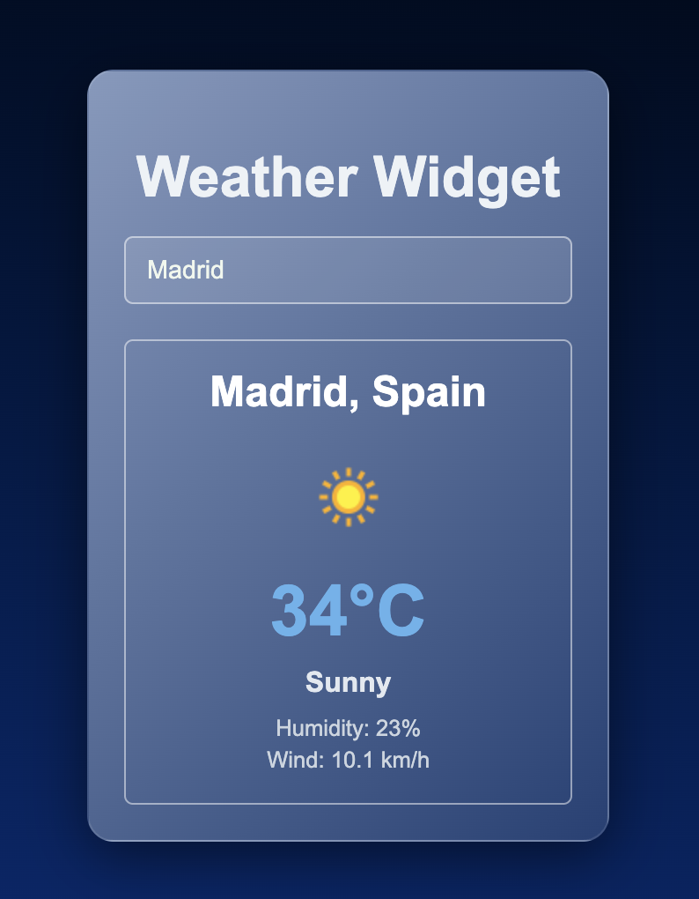

# 🌤️ Weather Widget

Простое и стильное React-приложение, которое отображает текущую погоду в указанном городе или по геолокации пользователя. Используется API от [WeatherAPI](https://www.weatherapi.com/).

<p align="center">
  
</p

## 🚀 Возможности

- Получение прогноза погоды по названию города
- Определение текущего местоположения через геолокацию браузера
- Отображение:
  - Температуры воздуха
  - Состояния погоды (солнечно, облачно и т.д.)
  - Влажности
  - Скорости ветра

## ⚙️ Установка и запуск

1. Клонируйте репозиторий:
    ```bash
    git clone https://github.com/ваш-профиль/weather-widget.git
    cd weather-widget
    ```

2. Установите зависимости:
    ```bash
    npm install
    ```

3. Получите API-ключ на [weatherapi.com](https://www.weatherapi.com/) и вставьте его в файл `App.jsx`:

    ```js
    const API_KEY = "ВАШ_API_КЛЮЧ";
    ```

4. Запустите проект:
    ```bash
    npm run dev
    ```

    или если используется Create React App:

    ```bash
    npm start
    ```

## 📁 Структура проекта

<pre>
weather-wiget/
├── node_modules/
│
├── public/
│   ├── vite.svg
│   └── widget.png              # Изображение виджета для README или иконка
│
├── src/
│   ├── App_v2.jsx              # Альтернативная или старая версия компонента
│   ├── App.jsx                 # Основной компонент приложения
│   ├── index.css               # Глобальные стили
│   └── main.jsx                # Точка входа React-приложения
│
├── .gitignore
├── eslint.config.js
├── index.html
├── package.json
├── package-lock.json
├── README.md
└── vite.config.js
</pre>


## 📄 Лицензия

Проект распространяется под лицензией MIT.

---

> Разработано с ❤️ на React